# Previx — Case Study

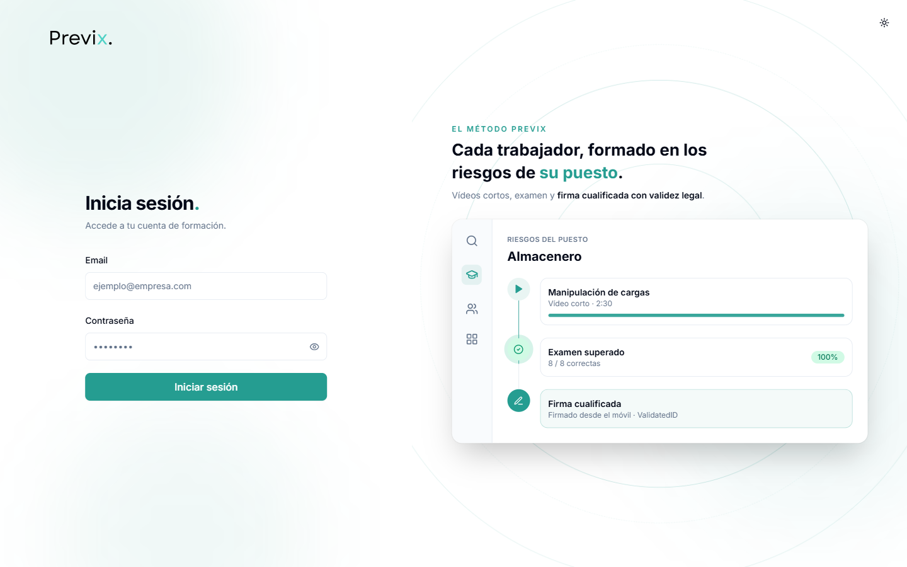

Previx is a multi-tenant SaaS platform for occupational risk-prevention (health & safety)
training. Companies enroll their workforce, each employee completes video-based courses and
exams for their specific job role, and at the end they sign a legally-binding training
certificate over SMS. The platform ships with three distinct portals — Worker, HR/Manager,
and Admin — and a single-sign-on integration that lets an existing client's intranet log
employees straight into their assigned courses.

All data shown below comes from disposable sandbox/demo accounts. Where a screenshot from
the Admin panel could have exposed the one real production client on the platform, that row
has been cropped or blurred.

---

## Worker Portal

The worker portal is the highest-traffic surface: every employee lands here to complete the
training assigned to their job role.

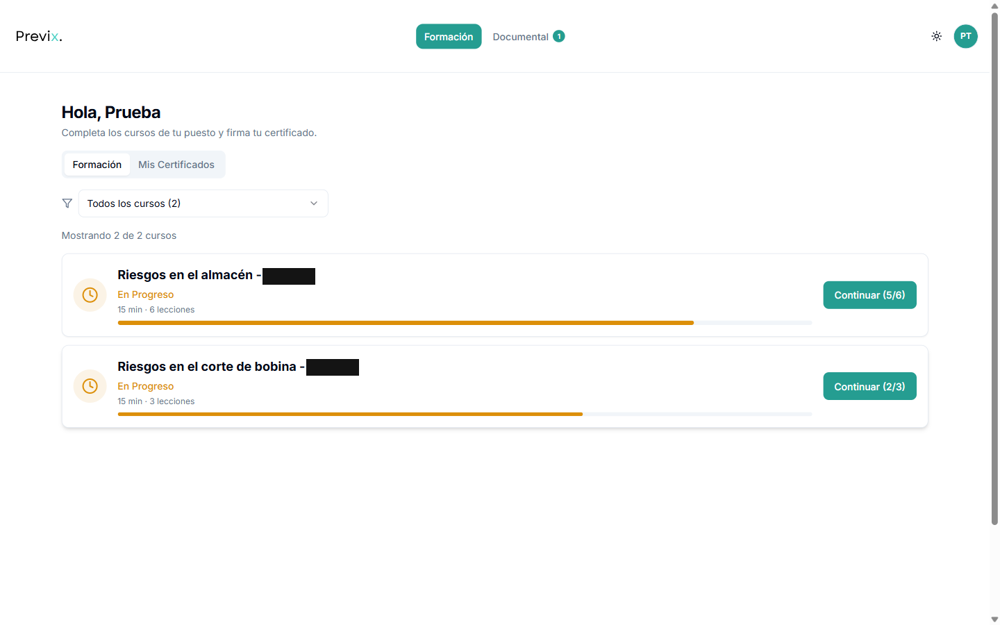

Courses are scoped per worker by job role and company, and progress is tracked lesson-by-lesson
rather than as a single "done" flag. This lets the platform re-open a course mid-way (e.g. after
a periodic re-certification cycle resets it) without losing per-lesson history — a requirement
that came directly from how PRL law expects recurring, auditable training.

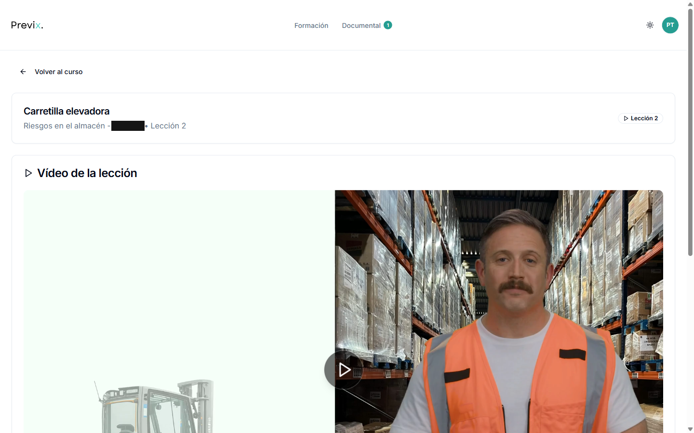

Each lesson pairs a short role-specific video with a mandatory quiz before the next lesson
unlocks. Gating progression on the video (rather than just the quiz) was a deliberate choice:
regulators expect evidence the worker was actually exposed to the safety content, not just that
they guessed the right multiple-choice answers.

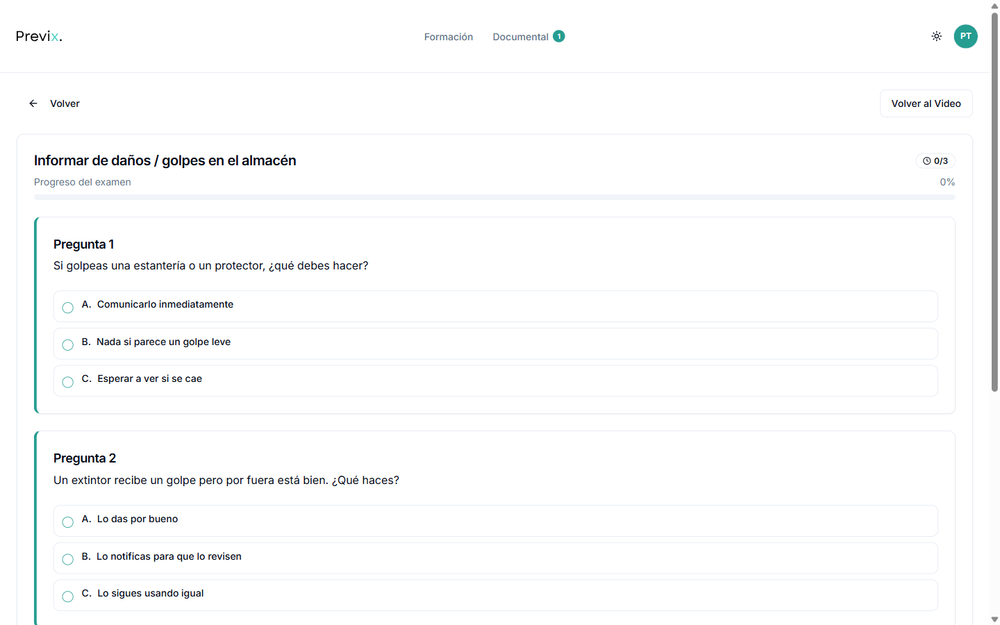

Exams are graded server-side, not in the browser: the correct answers never ship to the
client, and a Postgres RPC (`corregir_examen`) is the only thing allowed to mark an exam
passed or create the resulting certificate. This closes an obvious cheating vector — a
worker (or a browser devtools console) editing client-side JS to force a "pass".

---

## HR / Manager Portal (RRHH)

Companies access this portal either via normal login or SSO from their own intranet. It's
built for one job: keeping an HR manager on top of whether their team is compliant.

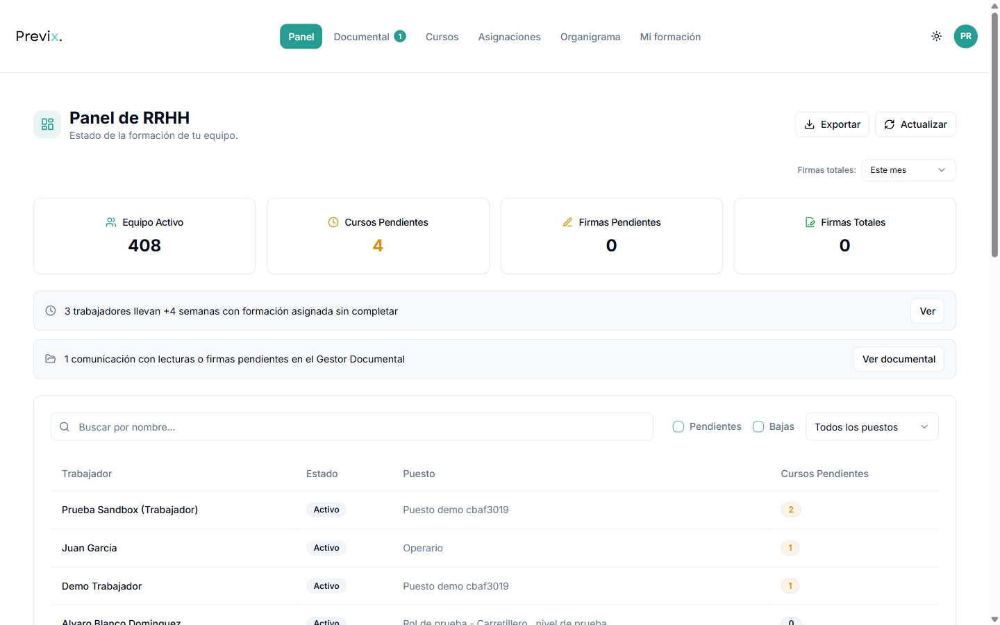

The dashboard leads with the numbers HR actually gets asked for — active headcount, courses
still pending, signatures pending/total — and surfaces proactive alerts (e.g. "3 workers have
had training assigned for 4+ weeks without completing it") instead of making the manager go
hunting through a worker list to find compliance gaps.

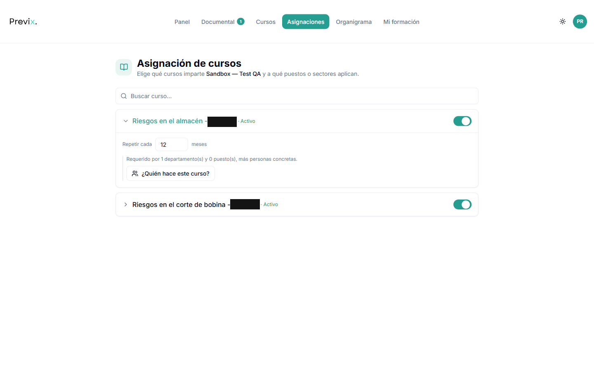

Training isn't assigned person-by-person. HR maps each course to departments, job roles, or
specific people, sets a re-certification cadence (e.g. every 12 months), and the platform
resolves that into per-worker assignments automatically — including workers who join the
company later and match the rule.

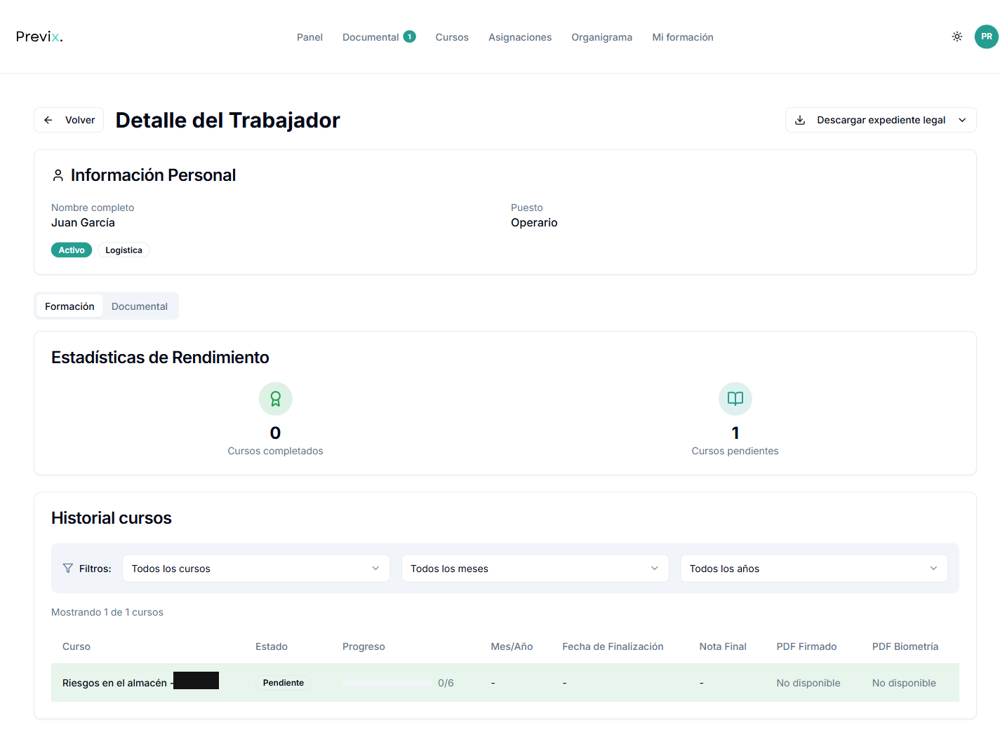

Every worker has a full course history with the legal paper trail attached: completion date,
final grade, and links to both the signed PDF and its biometric signature evidence file. This
same record is what gets bundled into a downloadable "legal case file" (a zipped, hash-manifested
export) if the company ever needs to produce evidence for a labor inspection or a court case.

---

## Admin Panel

The admin panel is internal-only — Previx's own team uses it to operate the platform across
all client companies. Nothing here is exposed to a company's own HR staff.

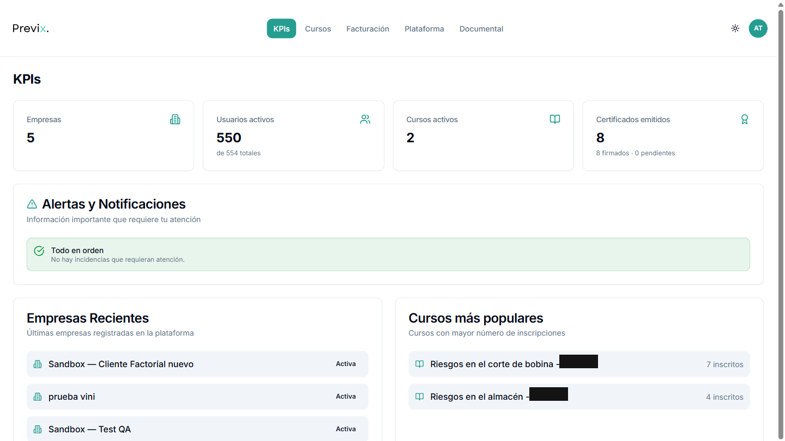

A cross-tenant view of the whole platform: how many companies, how many active users, how
many certificates have actually been signed. This is the first thing to check before a support
call — most "is something broken?" questions get answered here before touching a single
company's data.

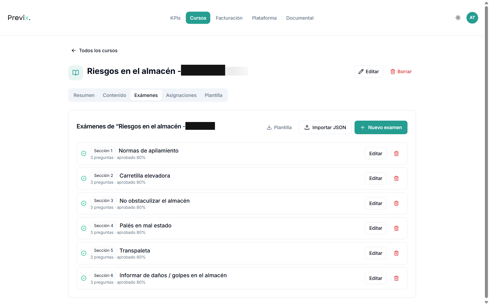

Course content (lessons, videos, per-lesson exams with pass thresholds) is authored once and
then can be shared across multiple client companies — the company tag next to the title has
been redacted here, but the underlying point is that content and company assignment are
decoupled, so a generic "forklift safety" course doesn't need to be duplicated per client.

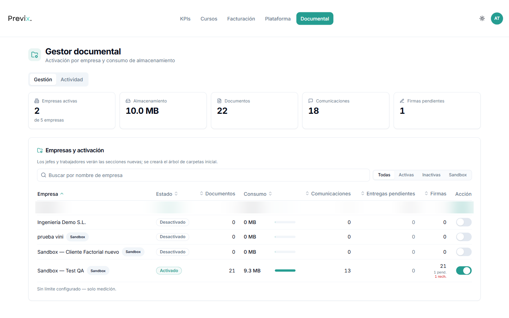

Previx's optional Document Manager module (secure file sharing + messaging + signature between
HR and workers) is a good example of the platform's feature-flag architecture: it's fully built
and 100% additive on the same database, but sits inert until an admin explicitly switches it on
for a given company. The one row with real production usage numbers is blurred here.

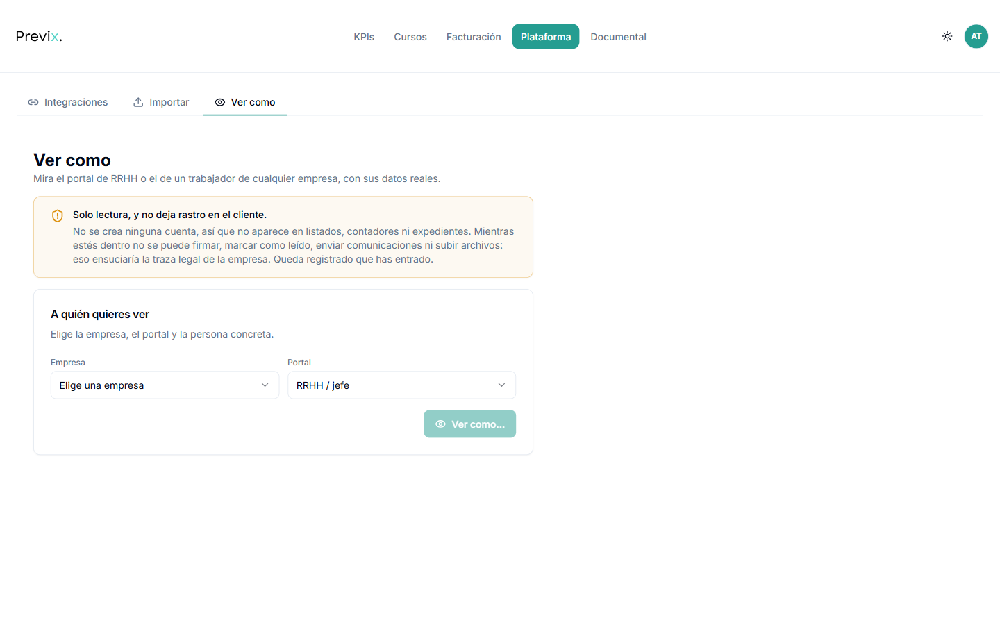

Rather than giving support staff a real login to a client's account (which would pollute that
company's own audit trail), admins can view any company's HR or worker portal in a strictly
read-only mode: no signing, no marking-as-read, no sending messages. The access itself is still
logged — so support gets visibility without ever being able to quietly alter a client's legal
record.

---

## Tech Stack

**Frontend:** React 18 + TypeScript, Vite, TailwindCSS, shadcn/ui (Radix), TanStack Query,
react-hook-form + zod, react-router-dom.
**Backend:** Supabase (PostgreSQL, Auth, Storage, Edge Functions on Deno), with Postgres RLS
policies and `SECURITY DEFINER` RPCs enforcing access control and business rules directly at
the database layer.
**Integrations:** ValidatedID (VIDsigner) for qualified electronic signatures over SMS, SMTP
via Nodemailer for automated reminder emails, and a token-based public REST API for external
HR systems (e.g. Factorial) to sync employee census and training progress.
**Infra:** Vercel (frontend, auto-deployed from `main`), Supabase Edge Functions + `pg_cron`
for scheduled jobs (signature reminders, course-expiry resets, low-balance alerts).
